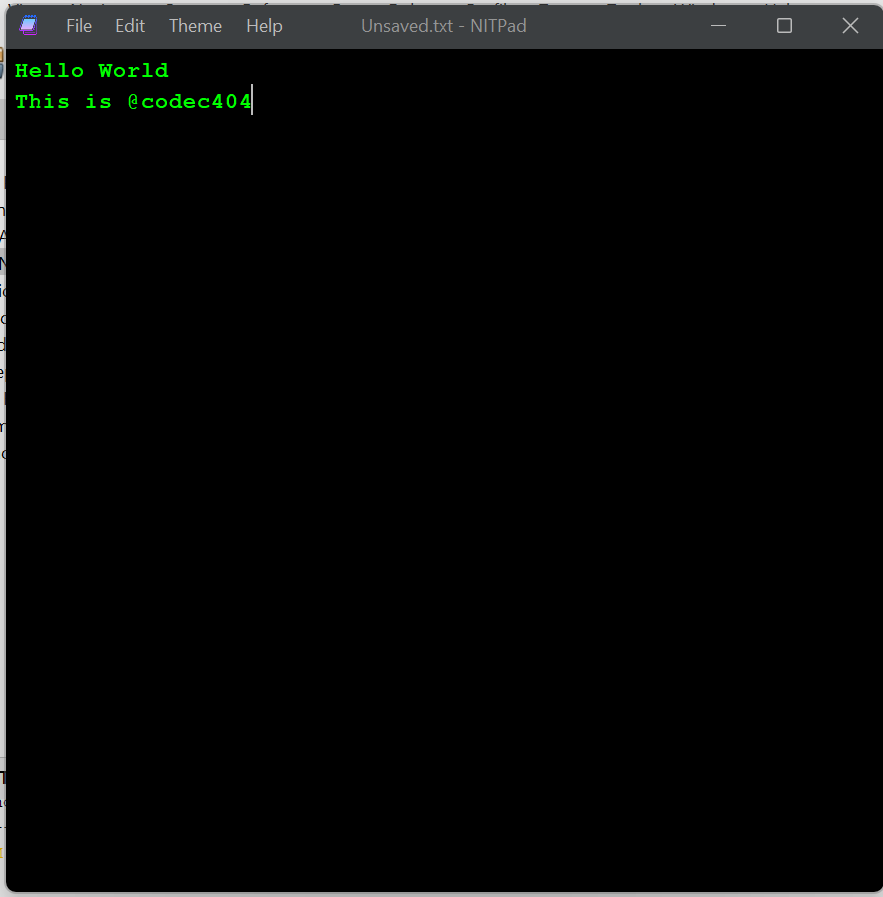
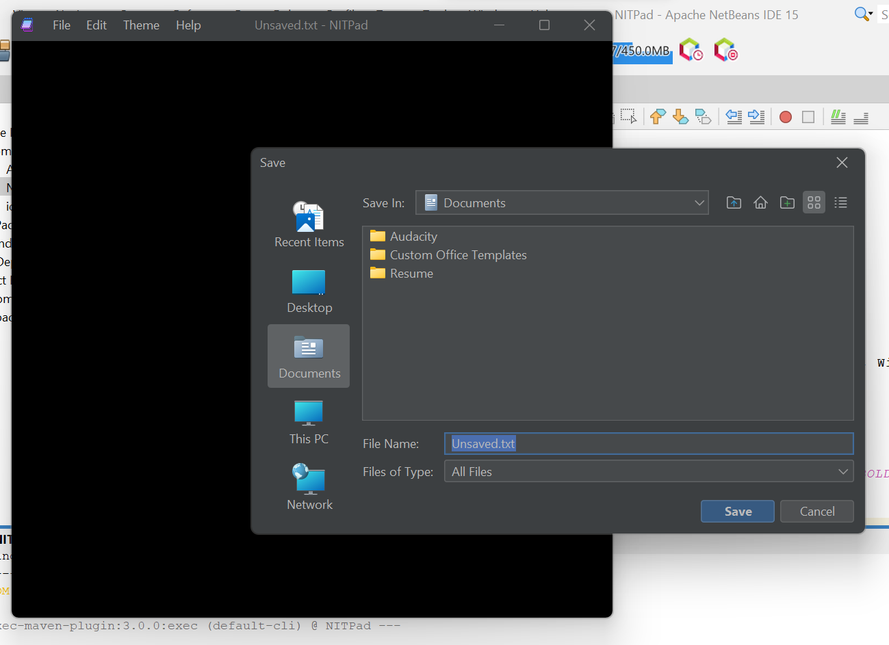
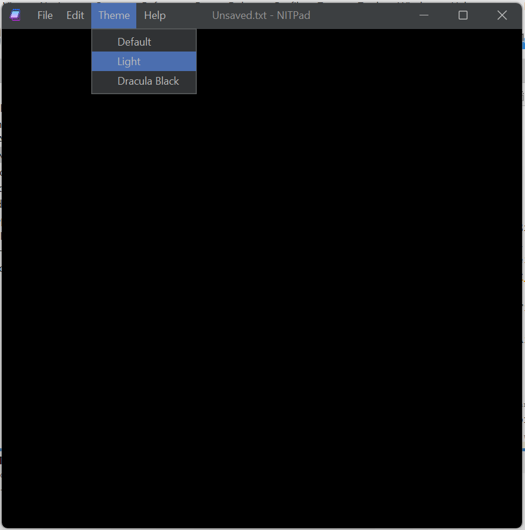

# NITPad
This is a clone of Windows Notepad. Quite large number of Notepad Features are inculcated into it.
## Authors

- [@codec404](https://github.com/codec404)


## Installation

Clone this project with git clone command in the terminal

```bash
git clone https://github.com/codec404/MyTxtEdtr
```
    
## Deployment

To deploy this project run

```bash
  App.java
```
A window appears similar to Windows Notepad in a new look. The name on the title bar is "NITPad".

## Requirements

No Pre-requisites.
Installation of a java-specific IDE(More specifically [Net Beans IDE](https://netbeans.apache.org/)) is advised to get proper results.
### For themes:
You need to add a ```.jar``` file to your Dependencies Folder.
#### Website Link: 
```
https://www.formdev.com/flatlaf/#download
```
I have made use of [Darcula Darker Theme](https://plugins.jetbrains.com/plugin/12692-darcula-darker-theme).

## Documentation

[Documentation](https://www.javatpoint.com/java-swing)

The above link leads to the documentation page. It will be helpful for the users to get knowledge about the several Java Swing Classes and Interfaces used in this project.
## Features

- Save and Open File

- Responding to KeyBoard Shorycuts
- Change the Text Area theme

- Can open a new window

*And many more you get when you explore*

